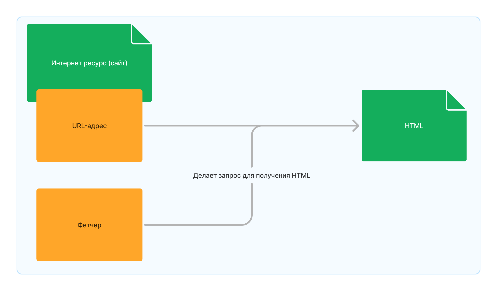

# Конфигурация фетчеров

Фетчеры (`fetchers`), или сборщики - это специальные объекты, 
которые по URL-адресу извлекают данные с HTML страниц, 
и возвращают HTML-код собираемой страницы.



## Фетчер по-умолчанию

Обычно для всех страниц используется один и тот же фетчер по-умолчанию - `AiohttpFetcher`, 
который просто через библиотеку `aiohttp` делает запрос на страницу и получает ответ в виде HTML-кода.

Но иногда контент страниц может загружаться динамически, 
то есть не быть доступным при прямом запросе на страницу.
Например, такое происходит, если необходимый контент загружается с помощью `Javascript`, `AJAX` или других технологий.

В этом случае мы не можем использовать `AiohttpFetcher` и требуется что-то другое. 

К счастью мы можем использовать фетчер на основе `selenium` - `SeleniumFetcher`.

```{note}
**Selenium** - это библиотека для управления браузеров, которая, в частности, 
позволняет автоматизировано посещать сайты и извлекать их HTML-код.
```

## Конфигурация

Конфигурация в `settings.py` выглядит следующим образом:
```py
...
FETCHERS_CONFIG = {
    "https://example.com/education-programs/": {{ABCFetcher}},
    "https://example.com/materials/*": {{ABCFetcher}},
}
```

## Пример 

Рассмотрим пример.

Нам нужно, чтобы **сайт <https://example.com/education-programs/>** 
и **URL-адреса, начинающиеся с <https://example.com/materials/>,** парсились динамически.

Тогда добавим `SeleniumFetcher` в наш `settings.py` следующим образом.
```py
from selenium import webdriver
from ai_assistant_parsers_core.fetchers import SeleniumFetcher
...
fetcher = SeleniumFetcher(webdriver.Firefox)
FETCHERS_CONFIG = {
    "https://example.com/education-programs/": fetcher,
    "https://example.com/materials/*": fetcher,
}
```

Теперь весь контент с этих URL-адресов будет собираться через браузер.

```{tip}
Вместо `webdriver.Firefox`, можно использовать `webdriver.Chrome`, если вы используете Google Chrome.

Для более детальной информации о входных параметрах обратитесь к документации `SeleniumFetcher`.
```

```{note}
Если вы знакомы с `selenium`, то наверняка знаете, 
что он требует установки специального драйвера работы с браузерами.

Но не беспокойтесь, `SeleniumFetcher` сам установит нужный драйвер для работы `selenium`.
```
