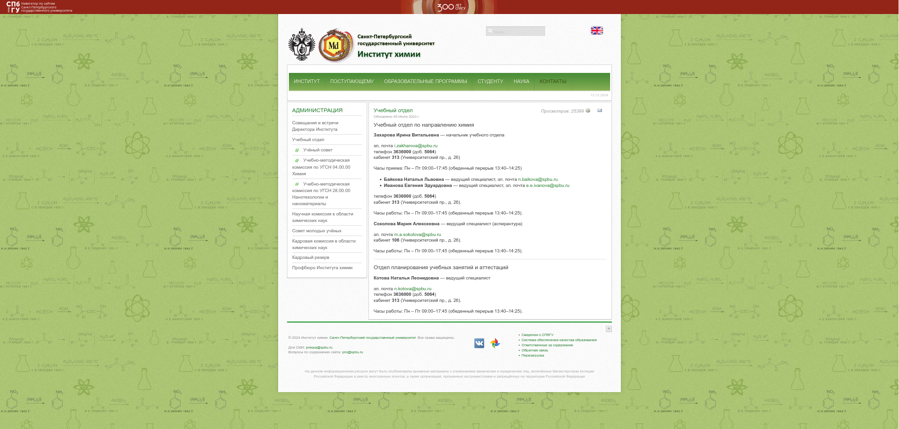
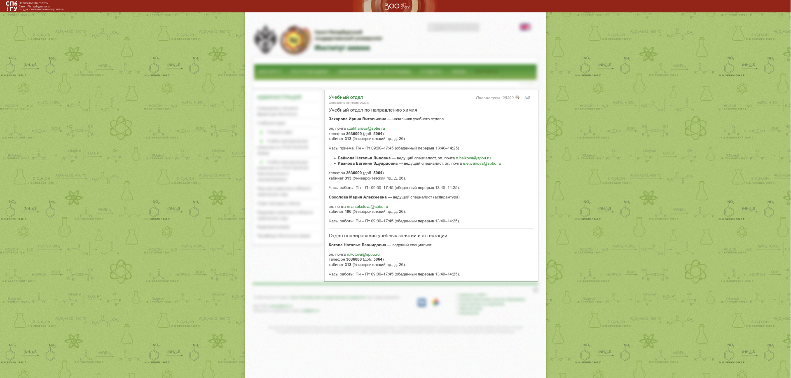
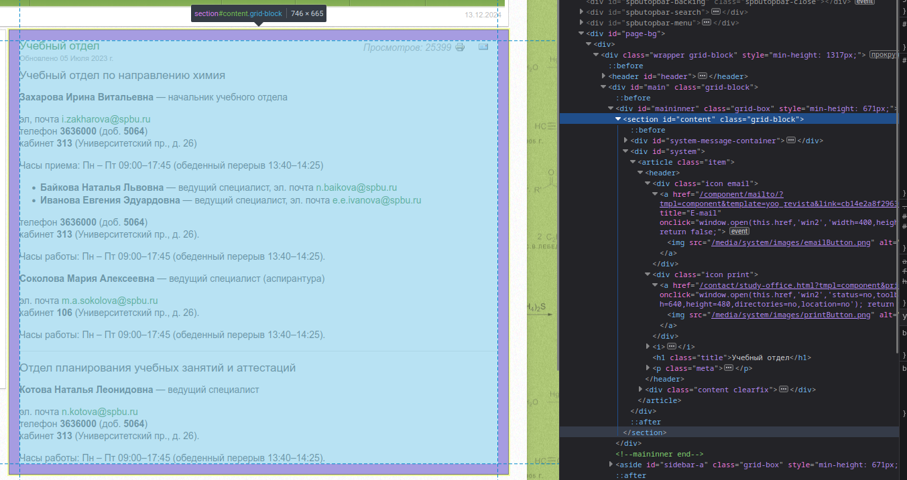
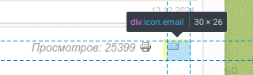
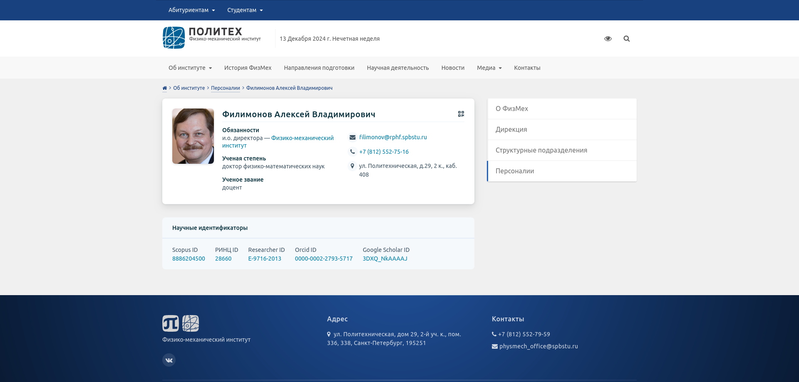
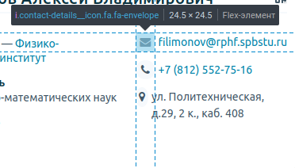

# Философия парсинга

## Краткий обзор

При парсинге сайтов часто возникают вопросы:

- Что именно парсить на странице?
- Как наиболее эффективно создавать парсеры?
- Какие блоки на странице нужно очищать?
- Какие блоки нужно реструктурировать?

На эти и многие другие вопросы, которые возникают в процессе написания 
парсеров для страниц, даёт ответ философия. 
Под её влиянием и создаётся весь проект.

## Шаблон страницы и её основной контент

Основным понятием в парсинге можно выделить - **шаблон страницы**.
Простыми словами это часть страницы, которая одинаковая для различных страниц на сайте.

Рассмотрим в качестве примера сайт https://chem.spbu.ru

Вот первый пример страницы (https://chem.spbu.ru/research/nauchnaya-komissiya/meetings.html):


А вот второй (https://chem.spbu.ru/contact/study-office.html):



Как мы видим, на странице есть куча блоков, которые не меняются с изменением самой страницы.

Блоки, которые не входят в **шаблон станицы** будем называть **основным контентом страницы**, 
так как только они буквально содержат основную информацию страницы :).

Например, для второго примера основным контентом будет:




## Этапы парсинга

Философия парсинга подразумевается всего 3 основных 
этапа для написания успешного парсера:

1. **Выделение:** Требуется выделить основной контент страницы.
2. **Очистка:** При необходимости требуется очистить основной контент от лишних блоков.
3. **Реструктурирование:** При необходимости требуется менять HTML-код 
внутри основного контента для улучшения качества текста.

Давайте рассмотрим каждый из этапов подробнее!


## Выделение

Самый простой и важный этап.
Суть банальна - найти блоки или группу блока, которые содержат основной контент страницы.

Для нашего сайта весь основной контент будет под блоков с CSS-селектором `#content`:




## Очистка

Отлично, теперь у нас есть основной контент страницы!

Но есть проблема - внутри нашего основного контента всё ещё есть блоки, которые повторяются на других страницах:

- Счётчик просмотров.
- Иконка для печати страницы.
- Иконка для отправки страницы по E-mail.



Их можно очистить с помощью хитрых CSS-селекторов:

- `i:has(> .icon.print)` для счётчика просмотров.
- `.icon.print:has(> a)` для иконки печати страницы.
- `.icon.email` для иконка отправки страницы по E-mail.


## Реструктурирование

Иногда приходится изменять структуру HTML-страницы для правильной передачи информации о некоторых элементов 
на странице, чтобы они передували туже информацию, как на сайте.

Для этого рассмотрим другой более сложный сайт будем насматривать страницы начинающеюся на https://physmech.spbstu.ru/person/
(Например, https://physmech.spbstu.ru/person/filimonov_aleksey_vladimirovich/):



Мы видим, что на сайте присутствуют иконки:



> Но как нам передать смысл этих иконок в виде текста?

Только изменить текст сайта, преобразовывая каждую иконку в текст, например:

- Для `.fa-envelope` - **Электронная почта**
- Для `.fa-tasks` - **Расписание занятий**
- Для `.fa-phone` - **Телефон**
- И так далее

Тем самым мы применили реструктурирования для сохранения смысла страницы при парсинге.

## Примеры реализации кода

Для https://chem.spbu.ru будем иметь:

```py
from bs4 import BeautifulSoup

from ai_assistant_parsers_core.parsers.utils.clean_blocks import clean_one_by_select
from ai_assistant_parsers_core.parsers import SimpleSelectDomainBaseParser


class ChemDomainParser(SimpleSelectDomainBaseParser):
    def __init__(self) -> None:
        super().__init__(
            allowed_domains_paths=["chem.spbu.ru"],
            select_arguments=["#content"],
        )

    def _clean_parsed_html(self, soup: BeautifulSoup) -> None:
        clean_one_by_select(soup, "i:has(> .icon.print)")  # Счётчик просмотров
        clean_one_by_select(soup, ".icon.print:has(> a)")  # Печать
        clean_one_by_select(soup, ".icon.email")  # E-main
```

Для страниц начинающеюся на https://physmech.spbstu.ru/person/ будем иметь:

```py
from bs4 import BeautifulSoup

from ai_assistant_parsers_core.parsers.utils.clean_blocks import clean_one_by_select
from ai_assistant_parsers_core.parsers import SimpleSelectDomainBaseParser


class ChemDomainParser(SimpleSelectDomainBaseParser):
    def __init__(self) -> None:
        super().__init__(
            allowed_domains_paths=["physmech.spbstu.ru"],
            select_arguments=["main"],
        )

    def _clean_parsed_html(self, soup: BeautifulSoup) -> None:
        clean_one_by_select(soup, ".breadcrumbs")
        clean_one_by_select(soup, ".sidebar")

    def _restructure_parsed_html(self, soup: BeautifulSoup) -> None:
        icons_data = [
            dict(tag="fa-envelope", title="Электронная почта"),
            dict(tag="fa-tasks", title="Расписание занятий"),
            dict(tag="fa-phone", title="Телефон"),
            dict(tag="fa-fax", title="Факс"),
            dict(tag="fa-map-marker", title="Адрес"),
            dict(tag="fa-flag", title="Адрес"),
            dict(tag="fa-calendar", title="Расписание"),
        ]
        for icon_data in icons_data:
            for tag in soup.select(f".person .contact-details__item > .{icon_data['tag']}"):
                tag.name = "span"
                tag.replace_with(BeautifulSoup(f"<b>{icon_data['title']}:</b> ", "html.parser"))
```
