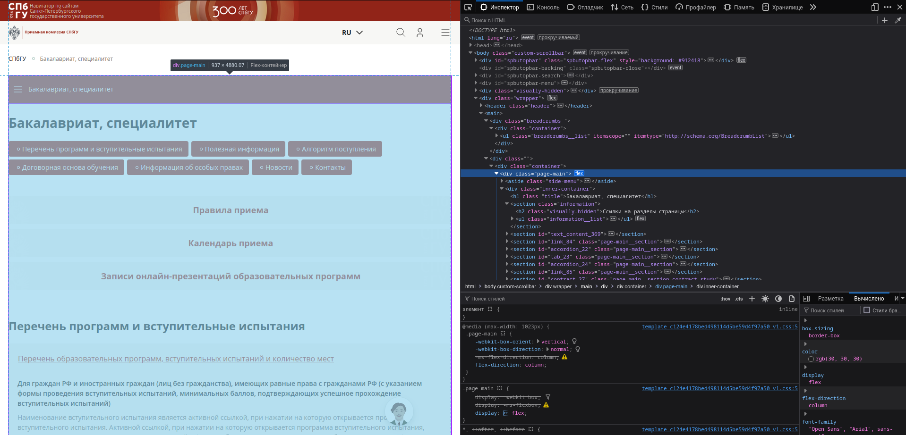

# Туториал по использованию проекта AI-ассистента

Добро пожаловать в туториал по использованию проекта AI-ассистента! 
Этот пошаговый guide поможет вам освоить основные принципы работы с нашим инструментом для извлечения данных из веб-страниц.

## Введение

Парсеры в нашем проекте служат для извлечения и обработки данных из HTML-страниц. 
Они могут быть настроены для работы с различными типами страниц, будь то отдельные домены, несколько доменов или отдельные страницы. 
В этом туториале вы узнаете, как создать парсеры для каждого типа страниц, а также как оптимизировать их для получения только нужного контента.

Все парсеры делятся на 3 основные группы:

1. **Парсеры одного домена** (`domain`)
2. **Парсеры нескольких доменов** (`multiple_domains`)
3. **Парсеры одной страницы** (`page`)

Каждая группа парсеров находится в папке `src/[имя_вашего_модуля]/parsers/`. <br>
В каждой папке вы найдете файл `_template.py`, который содержит начальный код для копирования и адаптации.

Давайте для начала напишем парсеры для группы `domain`.

(парсеры-для-одного-домена)=
## Парсеры для одного домена

Давайте напишем парсер для домена `abiturient.spbu.ru`. <br>
Сначала скопируем код с `_template.py`:
```py
from bs4 import BeautifulSoup

from ai_assistant_parsers_core.parsers.utils.clean_blocks import *
from ai_assistant_parsers_core.parsers.utils.restructure_blocks import *
from ai_assistant_parsers_core.parsers import SimpleSelectDomainBaseParser


class ВСТАВИТЬ_ТЕКСТ_СЮДАDomainParser(SimpleSelectDomainBaseParser):
    def __init__(self) -> None:
        super().__init__(
            allowed_domains_paths=["ВСТАВИТЬ_ТЕКСТ_СЮДА"],
            select_arguments=["ВСТАВИТЬ_ТЕКСТ_СЮДА"]
        )
```
Теперь мы изменим название класса на `AbiturientDomainParser`, а параметр `allowed_domains_paths` заменим на `["abiturient.spbu.ru"]`:
```py
class AbiturientDomainParser(SimpleSelectDomainBaseParser):
    def __init__(self) -> None:
        super().__init__(
            allowed_domains_paths=["abiturient.spbu.ru"],
            select_arguments=["ВСТАВИТЬ_ТЕКСТ_СЮДА"],
        )
```

### Что такое `select_arguments`?

Как мы видим нам ещё требуется `select_arguments`, но что же это?

CSS-Selector - это шаблон для поиска элементов в HTML-документах. Парсер использует эти селекторы для нахождения нужных тегов и их детей. Если вы не знакомы с CSS-селекторами, рекомендуем ознакомиться с ними здесь:
- https://developer.mozilla.org/ru/docs/Web/CSS/CSS_selectors
- https://facelessuser.github.io/soupsieve/selectors/


От нас требуют как раз список специальных CSS-Selector, которые укажут парсеру какие HTML-теги вместе с их детьми оставить в структуре HTML-кода. <br/>
Все остальные теги будут удалены из структуры HTML-кода. Например, шапка и подвал, которые встречаются на всех страницах, но не несут полезной нам информации. <br/>

Простыми словами: с помощью селекторов вы указываете HTML-теги, в которых хранится полезный контент страницы. Все остальные теги будут проигнорированы.

### Пример использования select_arguments

Давайте рассмотрим какую-то страницу из нашего поддомена, например https://abiturient.spbu.ru/programs/bakalavriat/.
Через консоль разработчика можно определить, что нужный контент находится в блоке `.page-main`:



Тогда наш код будет выглядеть так:

```py
class AbiturientDomainParser(SimpleSelectDomainBaseParser):
    def __init__(self) -> None:
        super().__init__(
            allowed_domains_paths=["abiturient.spbu.ru"],
            select_arguments=[".page-main"],
        )
```

### Очистка HTML-кода

Но погодите, вместе с `.page-main` захватывается блок `.page-main > aside`, который не содержит полезной информации.

К счастью в этом случае у нас есть 2 метода для реализации в нашем классе: 
- `_clean_parsed_html` - для очистки HTML-кода.
- `_restructure_parsed_html` - для изменения структуры HTML-кода.

Давайте воспользуемся методом `_clean_parsed_html` и утилитами из `ai_assistant_parsers_core.parsers.utils.clean_blocks`:
```py
from bs4 import BeautifulSoup

from ai_assistant_parsers_core.parsers.utils.clean_blocks import clean_one_by_select
...
class AbiturientDomainParser(SimpleSelectDomainBaseParser):
    def __init__(self) -> None:
        super().__init__(
            allowed_domains_paths=["abiturient.spbu.ru"],
            select_arguments=[".page-main"],
        )
        
    def _clean_parsed_html(self, soup: BeautifulSoup) -> None:
        clean_one_by_select(soup, ".page-main > aside")
```
Та-дам, теперь блок `.page-main > aside` будет очищен, что прекрасно.

### Изменение структуры HTML
Но есть ещё пара проблем - давайте рассмотрим их по порядку

1. Блоки `.useful-info` обрабатываются не корректно. 
А именно: блок `.useful-info__link` не нужен, а блок `h2.info-definition__title` должен иметь тег `h4`, а не `h2`
2. Блоки `.accordion__button > span` не помечены тегом заголовка, но несут его смысловую нагрузку.

Давайте это исправим, используя `_restructure_parsed_html` и `ai_assistant_parsers_core.parsers.utils.restructure_blocks`.

Тогда наш полный код будет выглядеть следующим образом:
```py
from bs4 import BeautifulSoup

from ai_assistant_parsers_core.parsers.utils.clean_blocks import clean_all_by_select, clean_one_by_select
from ai_assistant_parsers_core.parsers.utils.restructure_blocks import rename_all_by_select
from ai_assistant_parsers_core.parsers import SimpleSelectDomainBaseParser


class AbiturientDomainParser(SimpleSelectDomainBaseParser):
    def __init__(self) -> None:
        super().__init__(
            allowed_domains_paths=["abiturient.spbu.ru"],
            select_arguments=[".page-main"],
        )
        
    def _clean_parsed_html(self, soup: BeautifulSoup) -> None:
        clean_one_by_select(soup, ".page-main > aside")

    def _restructure_parsed_html(self, soup: BeautifulSoup) -> None:
        clean_all_by_select(soup, "button.useful-info__link")  # Кнопки "подробнее" не нужны из-за кривой структуры
        rename_all_by_select(
            soup,
            "h2.info-definition__title",
            "h4",
        )

        rename_all_by_select(soup, ".accordion__button > span", "h3")
```
И ура, мы написали парсер, который правильно очищает и перестраивает HTML-код, оставляя только нужные данные!

## Парсеры для нескольких доменов

Такие же парсеры, как и [парсеры для одного домена](#парсеры-для-одного-домена), но у них в параметре `allowed_domains_paths` задаётся список не с одним элементом, а со множеством.

Пример:
```py
from ai_assistant_parsers_core.parsers import SimpleSelectDomainBaseParser


_ALLOWED_SUBDOMAINS_PATHS = [
    "students.spbu.ru",
    "nauka.spbu.ru",
    "mil.spbu.ru",
]


class TMContentParser(SimpleSelectDomainBaseParser):
    def __init__(self) -> None:
        super().__init__(
            allowed_domains_paths=_ALLOWED_SUBDOMAINS_PATHS,
            select_arguments=["#tm-content"],
        )
```

## Парсеры для одной страницы

Такие же парсеры, как и [парсеры для одного домена](#парсеры-для-одного-домена), но включают параметр `included_paths`, который позволяет ограничить работу парсера определёнными URL.

Пример:
```py
from ai_assistant_parsers_core.parsers import SimpleSelectDomainBaseParser


class MainAbiturientPageParser(SimpleSelectDomainBaseParser):
    def __init__(self) -> None:
        super().__init__(
            allowed_domains_paths=["abiturient.spbu.ru"],
            select_arguments=["main"],
            included_paths=["/"],
        )
```

```{include} _additional_resources.md
```
