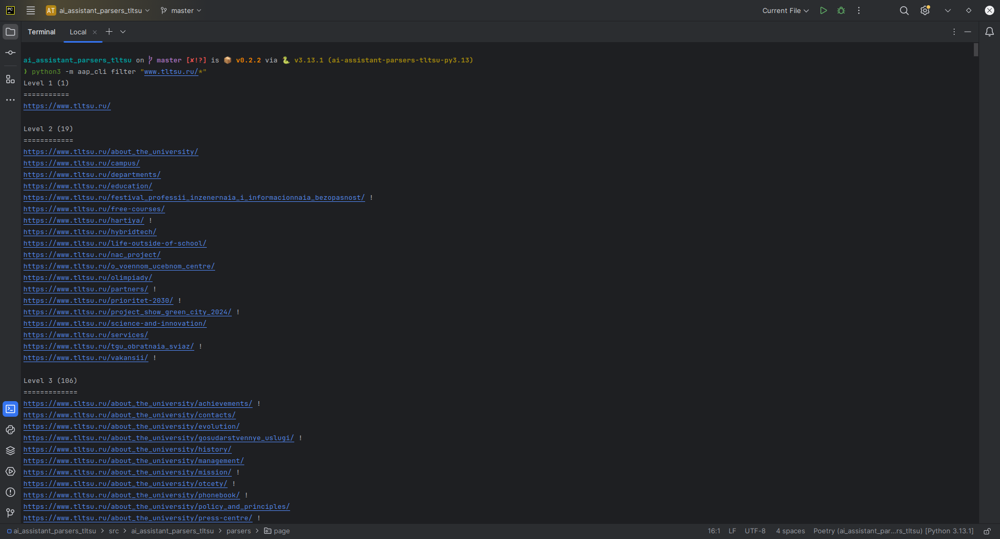

# Организуй свой проект!

Мы уже умеем писать и создавать парсеры для различных доменов/страниц

Но возникает уже другая проблема: **Для каких доменов/страниц нужно писать парсеры?**

Давайте детальнее посмотрим как организовать свой проект!

## Организация проекта

Для начала работы нам понадобятся следующие вещи:

- Уже созданный через шаблон проект
- CSV-файл со списком URL-адресов для парсинга

```{thumbnail} ../_static/images/tutorals/organize_your_project/1.png
```

```{note}
Колонки могут отличаться
```

Теперь нам нужно с этим CSV-файлов как-то работать

Давайте скачает CLI-утилиту, которая поможет нам с этим!

Устанавливается она следующим образом:
```haskell
poetry add --group dev git+https://github.com/GigaUniversityData/ai_assistant_parsers_cli_tools
```

Про саму утилиту можно почитать на [github](https://github.com/GigaUniversityData/ai_assistant_parsers_cli_tools), 
а нам важны будут только некоторые её команды (Я скрыл команды, которые нам не понадобятся):

```haskell
❯ python3 -m aap_cli --help                      
Usage: python -m aap_cli [OPTIONS] COMMAND [ARGS]...

Options:
  --help  Show this message and exit.

Commands:
  generate-structure       Автоматически выстраивает структуру проекта с сортировкой по путям URL-адреса.
  filter                   Фильтрует URL-адреса по fnmatch запросу.
  create-usage-table       Создаёт таблицу Markdown с распределением парсеров на URL-адреса.
```

Эти команды помогают нам писать парсеры проще и удобней. Так что давайте испытаем их в действии!

Для того чтобы команды работали с нашим CSV-файлом, нужно перенести наш CSV-файлов в `./sandbox/basic.csv`

```{thumbnail} ../_static/images/tutorals/organize_your_project/2.png
```

Теперь мы можем с ней работать

Теперь можем запускать

Запустим скрипт для генерации структуры доменных-парсеров


И заглянем в `./sandbox/autostructure`

```{thumbnail} ../_static/images/tutorals/organize_your_project/4.png
```

Как мы видим автоматически сгенерировалась структура сайта

Все URL адреса отсортированы по уровням вложенности, проще говоря по количеству `/` в пути. Например:

- `https://www.tltsu.ru` - имеет level 0
- `https://www.tltsu.ru/sveden` - имеет level 1
- `https://www.tltsu.ru/sveden/struct/upravlenie_po_rabote_so_studentami/stipendii` - имеет level 4

Мы можем зайти в каждый файлик и посмотреть какие URL адреса он парсит

```{thumbnail} ../_static/images/tutorals/organize_your_project/5.png
```

Как видно, парсер более высокого уровня (Например, level 0 выше level 1) обрабатывает все URL-адреса,
которые могли бы обработать парсеры более низкого уровня. То есть структуру парсеров можно представить в виде дерева

```{thumbnail} ../_static/images/tutorals/organize_your_project/6.png
```

А ещё с помощью этих файлов мы можем исследовать структуру всего сайта!

Теперь давайте отвлечёмся от нашей структуры и научится фильтровать URL-адреса

Для этого мы можем воспользоваться утилитой `aap_cli filter`

Принцип её работы максимально простой - она фильтрует URL-адреса по fnmatch-запросу



```{note}
Восклицательным знаком (`!`) обзначаются URL-адреса, которые не имеют под путей, то есть
которые не являются уже началом какого-либо пути

Например, если адрес `https://www.tltsu.ru/vakansii/`, то мы точно знаем, что в нашем списке URL-адресов нету адреса
`https://www.tltsu.ru/vakansii/Meow` или другого любого, начинающегося на `https://www.tltsu.ru/vakansii/`
```

Также поддерживается опция -l, позволяющая указать, какой диапазон уровней нас интересует, и другие интересные опции.

```{thumbnail} ../_static/images/tutorals/organize_your_project/8.png
```

Теперь мы имеем автоматически сгенерированную структуру парсеров доменов и умеем фильтровать URL-адреса.

Давайте теперь разберёмся как пользоваться нашей структурой

Для начала скопируем `sandbox/autostructure` в папку `src/ai_assistant_parsers_tltsu/parsers/domain/autostructure`

```{thumbnail} ../_static/images/tutorals/organize_your_project/9.png
```

Теперь выберем домен для рассмотрения. Пусть это будет главный домен - `www`

```{thumbnail} ../_static/images/tutorals/organize_your_project/10.png
```

Будем писать парсеры по принципу сверху вниз:

1. Имеем парсер более высокого уровня
2. Потом проверяем парсеры более низкого уровня. 
Если наш парсер более высокого уровня парсит все URL-адреса парсера более низкого уровня, 
то отдельный парсер для более низкого уровня нам писать не нужен! И его можно убрать
3. Убираем лишние парсеры из области видимости
4. Повторяем алгоритм для оставшихся парсеров 

Проще всего алгоритм представить визуально:

```{thumbnail} ../_static/images/tutorals/organize_your_project/11.png
```

```{hint}
Не забывайте, что для просмотра URL-адресов удобства вы всегда можете использовать `aap_cli filter` и его опции!
```

```{note}
При расмотрении URL-адресов парсера более низкого уровня вложенные пути нас не интересуют

Например, при расмотрении URL-адресов парсера `CampusWWWDomainParser` нам стоит расмотреть URL адреса: 
https://www.tltsu.ru/campus/corpuses/, https://www.tltsu.ru/campus/dorm/, https://www.tltsu.ru/campus/sport-complex/. 
Но не стоит расматривать вложенные пути уровня выше: 
https://www.tltsu.ru/campus/sport-complex/ceny/, https://www.tltsu.ru/campus/sport-complex/kontakty/ 
```

Чтобы убрать парсер из области видимости можно просто в названии файла добавить в начало нижнее подчёркивание (`_`)

```{thumbnail} ../_static/images/tutorals/organize_your_project/12.png
```

Но для удобства можно убирать и папки!

```{thumbnail} ../_static/images/tutorals/organize_your_project/13.png
```

Как мы видим, нам повезло, и пришлось писать только один парсер - `WWWDomainParser`

```{thumbnail} ../_static/images/tutorals/organize_your_project/14.png
```

Осталось только обновить импорты

```{thumbnail} ../_static/images/tutorals/organize_your_project/15.png
```

К счастью, утилита `mkinit` игнорирует пути с нижним подчёркиванием (`_`), поэтому мы можем просто запустить ей командой:

```haskell
python3 -m scripts.mkinit
```

```{thumbnail} ../_static/images/tutorals/organize_your_project/16.png
```

Теперь главный домен у нас готов! Аналогично работает и с оставшимся доменом `priem`

Тут нам немного не повезло и пришлось реализовывать 3 парсера, вместо одного

```{thumbnail} ../_static/images/tutorals/organize_your_project/17.png
```

Аналогично запускаем `mkinit`, чтобы получить красивую картину

```{thumbnail} ../_static/images/tutorals/organize_your_project/18.png
```

Теперь парсеры доменов готовы!

Парсеры доменов - это основной тип парсеров, который чаще всего используется

Но в зависимости от ваших вариантов использования вы можете использовать как парсеры нескольких доменов 
(В папке `src/ai_assistant_parsers_tltsu/parsers/multiple_domains`), так и парсеры отдельных страниц
(В папке `src/ai_assistant_parsers_tltsu/parsers/page`)

```{thumbnail} ../_static/images/tutorals/organize_your_project/19.png
```
